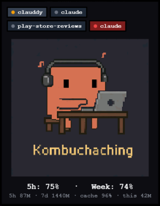

# Clauddy for Windows

A persistent always-on-top desktop widget that mirrors your Claude Code
session state. Multi-session aware, calibrates against `/usage` to show
your 5-hour and weekly budget as percentages.

<p align="center">
  
</p>

Inspired by [bugzmanov/divoom-minitoo](https://github.com/bugzmanov/divoom-minitoo).

## What it shows

The big face reflects whatever the currently-selected session is doing:

| Chilling | Working | Alerting |
|:---:|:---:|:---:|
|  |  |  |
| Idle / waiting on you | Streaming a response | Permission prompt waiting |

**Top row** — one pill per active Claude Code session. Click a pill to switch
the big face and focus that session's terminal. Red pill = alerting.

**Bottom row** — live `/usage`-equivalent metrics. Primary line shows percentages
once you calibrate; a smaller subtitle keeps the raw token counts and cache
hit rate visible.

## Install

Download `Clauddy-Setup.exe` from the [Releases](#) page and run it.
Per-user install, no admin rights required.

On first run, a wizard asks where to install hooks: Windows native shells
(Git Bash, PowerShell) and any WSL distros you have. Tick what you want,
click Install. After hook setup it offers calibration (see below).
Restart any open Claude Code sessions for the hooks to take effect.

## Calibrate to `/usage`

Right-click the widget body (or the tray icon) → **Calibrate /usage…**.
In any Claude Code session, type `/usage` and read the two percentages.
Paste them into the dialog and Save — Clauddy back-solves the per-window
caps and the metrics row switches to:

    5h: NN%  ·  Week: NN%

Recalibrate any time the widget and `/usage` drift apart. Without
calibration the widget falls back to raw token counts.

## How it works

Each Claude Code session reports its state via hook scripts that POST to
the widget over loopback HTTP. The widget shows one tile per active
session — `working` / `alerting` / `chilling`. See
[design spec](docs/superpowers/specs/2026-04-28-clauddy-windows-design.md).

## Tile labels

By default a tile shows the basename of the nearest ancestor directory
that has a `.claude/` folder (e.g. `clauddy`, `play-store-reviews`).
Override in any terminal:

    export CLAUDDY_LABEL="migration-agent"

## Tray / right-click menu

Either right-click the tray icon or right-click the widget body itself
(useful if your tray collapses or hides):

- **Show / Hide widget**
- **Reset position** — snaps back to bottom-right
- **Run at login** — toggle autostart
- **Manage hooks…** — re-run the install wizard
- **Calibrate /usage…** — sync the percentage display to `/usage`
- **Quit**

Other interactions:

- **Drag** anywhere on the widget body to move it.
- **Ctrl + mouse wheel** scales the widget 0.5×–3×.

## Logs

`%APPDATA%\Clauddy\log.txt` (rotated at 1 MB, last 3 files kept). Includes
hook arrivals (`hook upsert sid=… label=… state=… pid=…`) so you can see
exactly which sessions are reaching the widget.

## Uninstall

Settings → Apps → Clauddy → Uninstall. Hooks are cleanly removed from
`~/.claude/settings.json` (Windows + every WSL distro you installed
into).

## Build from source

```bash
dotnet test
dotnet publish src/Clauddy -c Release -o publish
iscc installer/Clauddy.iss
```

Output: `installer/Output/Clauddy-Setup.exe`.

## Attribution

Pixel-art GIF assets are bundled from
[bugzmanov/divoom-minitoo](https://github.com/bugzmanov/divoom-minitoo)
with thanks.
